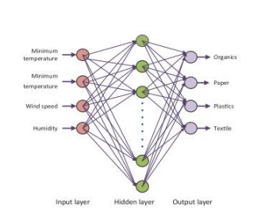

# Plastic Waste Classification System using Multispectral Imaging and Artificial Neural Network

This repository contains code and documentation for a plastic classification project using the Alvium 1800 U-501 NIR camera and a motorized filter wheel from Thorlabs.

## Overview

The project aims to classify different types of plastic using NIR imaging and machine learning techniques. NIR (Near Infrared) imaging is used for its capability to differentiate between various types of plastics based on their spectral responses.

## Components

### Hardware:
- Alvium 1800 U-501 NIR Camera
- Motorized filter wheel from Thorlabs

### Software:
- Python for image acquisition and processing
- Machine Learning libraries (e.g., TensorFlow, Scikit-learn) for classification
- Libraries for camera interfacing (e.g., Alvium SDK, Thorlabs SDK)

## Project Structure

The repository is structured as follows:

- `data/`: Contains sample datasets and collected images.
- `scripts/`: Python scripts for image acquisition, preprocessing, and classification.
- `docs/`: Documentation files, including datasheets and project reports.
- `models/`: Trained machine learning models for plastic classification.

## Usage

1. **Setup**: Install necessary Python libraries and SDKs for the camera and filter wheel.
   
2. **Data Collection**: Use scripts in `scripts/` to acquire NIR images of different plastic types.

3. **Preprocessing**: Implement preprocessing techniques to enhance image quality and extract relevant features.

4. **Training**: Train machine learning models using extracted features and labeled data.

5. **Classification**: Deploy trained models to classify new plastic samples based on NIR images.

## Contributing

Contributions to improve this project are welcome! Please fork the repository and submit pull requests with your enhancements.

## License

This project is licensed under the [MIT License](LICENSE).
